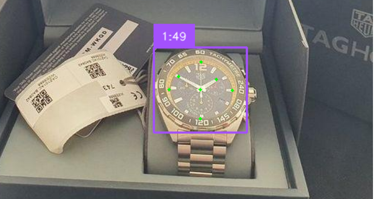

# Analog Watch Time Recognition



A computer vision system that detects analog watches and recognizes their time using YOLOv11 for object detection and keypoint estimation.

## Features

- 🕒 **Watch Detection**: Localize analog watches in images
- ⏰ **Time Recognition**: Predict hour and minute hands positions
- 📊 **Keypoint Estimation**: 7-point detection (center,hour,minute + 4 hour markers)
- 📈 **Performance Metrics**: mAP, precision, recall tracking

## Installation

### Prerequisites

- Python 3.10+
- [UV package manager](https://docs.astral.sh/uv/) (recommended) or pip
- GPU support recommended for faster inference

1. **Clone the repository**:

   ```bash
   git clone https://github.com/your-username/watch-recognition.git
   cd watch-recognition
   ```

2. **Install dependencies**:

   - Using _uv_.

   ```bash
   uv sync
   ```

   - Using _pip_.

   ```bash
   pip install -r requirements.txt
   ```

3. **🏗️ Project Structure**:

   - Add the following directory structure to the root directory:

   ```bash
   analog_watch_recognition/         # Root
   ├── annotations/
   │   └── keypoints/
   │       ├── labelstudio/          # Label Studio annotations
   │       └── yolo/                 # YOLO format annotations
   ├── datasets/
   │   ├── original/                 # Raw images
   │   └── yolo/                     # Generated YOLO dataset
   ├── models/
   │   └── keypoints/                # Trained models
   ```

4. **🚀 Usage**:

   **Command Line Interface**

   The main inference script provides a simple CLI for watch detection and time recognition:

   ```bash
    # Show help
   python -m src.watch_recognition.inference -h

   # Basic usage
   python -m src.watch_recognition.inference \
     -i test_images/raw/1.jpg \
     -o test_images/output

   # With custom model and hand visualization
   python -m src.watch_recognition.inference \
     -i input_image.jpg \
     -o output_directory/ \
     -m models/keypoints/custom.pt \
     --draw-hands
   ```

5. **🔧 Configuration**:

   **Dataset Setup**

   1. Place raw images in datasets/original/

   2. Export Label Studio annotations to `annotations/keypoints/labelstudio/` (JSON format)

   3. Update `dvc.yaml` with your annotation and model filenames.

   **Custom Directory Structure**

   Modify the `src/watch_recognition/config/config.yaml` file.

   ```yaml
   paths:
   output_dir: 'annotations/keypoints/yolo'
   ls_annotations_folder: 'annotations/keypoints/labelstudio'
   ```

6. **🔄 Reproducibility**:

   ```bash
   # Run the complete pipeline
   dvc repro

   # Run specific stages
   dvc repro convert_ann_ls_yolo
   dvc repro generate_yolo_dataset
   ```
