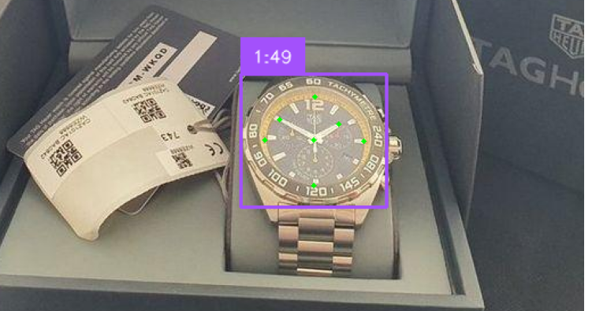

# Analog Watch Time Recognition



A computer vision system that detects analog watches and recognizes their time using YOLOv11 for object detection and keypoint estimation.

## Features

- 🕒 **Watch Detection**: Localize analog watches in images
- ⏰ **Time Recognition**: Predict hour and minute hands positions
- 📊 **Keypoint Estimation**: 7-point detection (center,hour,minute + 4 hour markers)
- 📈 **Performance Metrics**: mAP, precision, recall tracking

## Installation

1. **Clone the repository**:

   ```bash
   git clone https://github.com/your-username/watch-recognition.git
   cd watch-recognition
   ```

2. **Install dependencies**:
   This project uses [`uv`](https://docs.astral.sh/uv/) package manager,

   ```bash
   uv sync
   ```
